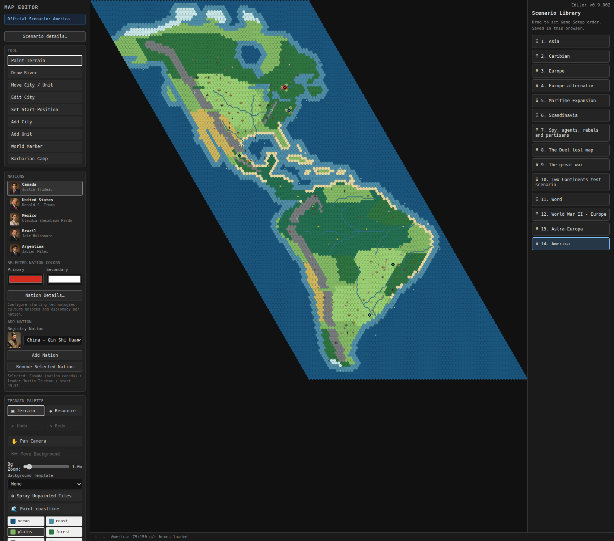

# America

America is an authored 75 × 150 scenario, registered as `map_america` in the existing map manifest. Select **New Game → America**, choose any of the five nations, and leave Resource Abundance at **Scenario** to use the authored deposits. Open **Scenario Editor → America** to edit it normally.

The scenario was composed in the existing browser editor with explicitly drawn continental outlines, terrain provinces, river routes and regional deposit locations, then exported with its normal scenario serializer. It contains no runtime generator, procedural seed, custom loader, or America-specific gameplay code. No editor or engine fixes were needed.

## Starts

Coordinates are the editor's axial `(q, r)` coordinates. Screen east-west positions include the row's half-column offset.

| Nation | Canonical leader | Capital site | Start | Unit |
| --- | --- | --- | --- | --- |
| Canada | Justin Trudeau | Ottawa | (49, 34) | Settler |
| United States | Donald J. Trump | Washington, D.C. | (46, 43) | Settler |
| Mexico | Claudia Sheinbaum Pardo | Mexico City | (20, 61) | Settler |
| Brazil | Jair Bolsonaro | Brasília | (51, 104) | Settler |
| Argentina | Javier Milei | Buenos Aires | (33, 124) | Settler |

The editor omits explicit leader IDs for canonical default leaders (Canada, Mexico and Argentina); Trump and Bolsonaro are explicit alternative selections. All five resolve correctly in the editor, Game Setup and the running game. Nation definitions, portraits, colors and city-name pools are reused.

The scenario begins in 4000 BC with no cities, researched technologies or culture unlocks. Modern leaders are a sandbox roster, not a claim about historical chronology. Subsequent city names follow the existing canonical pools: Brazil currently calls its first city **Rio de Janeiro**, although its authored founding site represents **Brasília**. No global naming behavior was changed.

## Geography and gameplay

The northern mainland includes Alaska, Arctic islands, Hudson Bay, Labrador, the Great Lakes, Florida, the Gulf of Mexico, Baja California and Yucatán. A deliberately widened Central American bridge connects to Colombia. Cuba, Hispaniola, Jamaica, Puerto Rico and a few smaller island groups suggest the Caribbean. South America includes Brazil's eastern bulge and a narrowing, cold southern cone.

Broad forest and meadow regions cross Canada and the United States. Western ranges have deliberate passes; southwestern North America is arid. Jungle follows Central America and forms a large Amazon basin. The Brazilian interior mixes grasslands and forests. The Andes flank western South America, with dry western terrain, productive Pampas and rougher Patagonia. Selected warm shorelines use Beach terrain; cold, western and temperate shorelines retain other terrain.

The Mississippi–Missouri–Ohio, St. Lawrence, Rio Grande, Amazon with three tributaries, Paraná–Paraguay–Uruguay/Río de la Plata, Orinoco and São Francisco are authored with the editor's shared reciprocal river connections. All 238 river tiles survive normalization unchanged. Water tiles are single-tile outlets, not offshore river reaches.

There are 190 deposits using 24 existing resource types. Food and livestock favor temperate grasslands; deer favor forests; tropical produce and gems favor jungle. Fossil fuels cluster around North American interior/Gulf basins, Mexico and selected South American basins. Brazilian iron, Andean copper/silver, and geographically separated aluminum/uranium support expansion and competition. Every start has at least three resources within four hexes and at least four immediately adjacent usable land tiles.

All five starts belong to the same land component even when mountains and ice are excluded from movement. Pacific and Atlantic water routes connect around the southern tip. The northern nations intentionally have much closer neighbors than Brazil and Argentina.



## Validation

Completed on 2026-09-08:

- Reopened the registered scenario through the editor's normal landing/template flow; export exactly matches the saved file.
- Visually inspected the whole map and enlarged north, central and south views, including all five Settlers, coastlines, terrain provinces and major rivers.
- Verified all 11,250 tiles, unique coordinates, canonical nation/leader identities, terrain-compatible deposits, river reciprocity, fertile starts, mainland connectivity and ocean passages.
- Started through **New Game → America → select nation → Start Game**, with all five nations enabled and default Scenario resource mode.
- Confirmed all five Settlers at the authored coordinates before AI turns, all five runtime leaders, and exact preservation of every authored resource and river mask.
- Advanced two rounds using existing diagnostics after normal game startup; all five nations founded their first cities at their authored starts, without browser runtime errors. Also launched separately as the United States, where Canada's first AI turn correctly founded Ottawa before the player's turn.
- TypeScript typecheck and all three content tests passed.

[Recorded browser validation](america/validation.json). Browser screenshots and a fresh report are written to `/tmp/epoch-america-validation` by default.

Reproduce with a local development server running:

```sh
node --import tsx --test --test-isolation=none tools/americaScenario.test.ts
npm run typecheck
EPOCH_URL=http://127.0.0.1:5174 node tools/americaScenario.browser.mjs
```

`CHROME_PATH` overrides the browser executable; `EPOCH_ARTIFACTS` overrides the screenshot/report directory. The two-round check validates startup and initial settlement, not long-term competitive balance.
